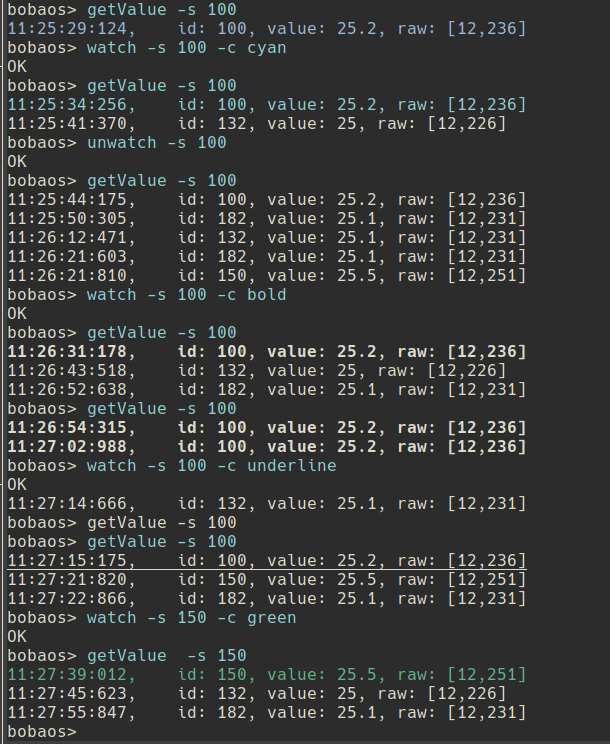

# bdsd-cli

Commad-line interface for Bobaos Datapoint Sdk.

## Installation

First, you need to install and run as a service [bdsd.sock](https://github.com/shabunin/bdsd.sock)

If it is already done, proceed to next steps:

```sh
$ sudo npm install -g bdsd-cli
```

## Usage

1.  Start the application

```sh
$ bdsd-cli
connected
bobaos>
```

`bdsd-cli` accepts `-s, --sockfile` parameter with path to bdsd.sock. Default is `$XDG_RUNTIME_DIR/bdsd.sock`.

2.  Get command list

```sh
bobaos> help
  Commands:

      help [command...]              Provides help for a given command.
      exit                           Exits application.
      getDatapoints                  Get all datapoint descriptions
      getDescription [options]       Get datapoint description
      getValue [options]             Get datapoint value
      readValue [options]            Send read request to bus
      setValue [options]             Set datapoint value
      setProgrammingMode [options]   Set programming mode
      getStoredValue [options]       Get stored datapoint value from bdsd.sock
      readValues [options]           Send read request to bus for multiple values
      setValues [options]            Send read request to bus for multiple numerical/bool values
      watch [options]                Highlight datapoint in log
      unwatch [options]              Remove datapoint value hightlight
```

3.  Try commands:

```sh
bobaos> setProgrammingMode -v 1
Set programming mode: success
bobaos> setProgrammingMode -v 0
Set programming mode: 1
bobaos> getDatapoints
[ { id: 1,
    length: 2,
    flags:
    { priority: 'low',
      communication: true,
      read: true,
      write: true,
      readOnInit: false,
      transmit: true,
      update: false },
      dpt: 'dpt9' },
  { id: 2,
    length: 1,
    flags:
    { priority: 'low',
      communication: true,
      read: false,
      write: true,
      readOnInit: false,
      transmit: true,
      update: false },
      dpt: 'dpt5' } ]
bobaos> getValue -s 1
14:01:35:504,    id: 1, value: 22, raw: [12,76]
bobaos> setValue -s 2 -v 0
bobaos> readValue -s 1
bobaos> readValue -s 2
14:01:56:106,    id: 2, value: 0, raw: [0]
bobaos> getDescription -s 1
{ id: 1,
  value:
  { id: 1,
    dpt: 'dpt9',
    flags:
    { priority: 'low',
      communication: true,
      read: true,
      write: true,
      readOnInit: false,
      transmit: true,
      update: false },
      length: 2 } }
bobaos> getStoredValue -s 1
14:02:25:748,    id: 1, value: 21.9, raw: [12,71]
bobaos> readValues -s "1, 2, 3"
14:02:44:399,    id: 1, value: 21.9, raw: [12,71]
14:02:44:483,    id: 2, value: 0, raw: [0]
14:02:44:607,    id: 3, value: 0, raw: [0]
bobaos> setValues -s "3:0, 4:0, 5:1"
bobaos>
```

Added in 2.0.10:

- Datapoint value hightlight:



- DBAD license

## Support me

You can send me a beer by PayPal

[](https://paypal.me/shabunin)
